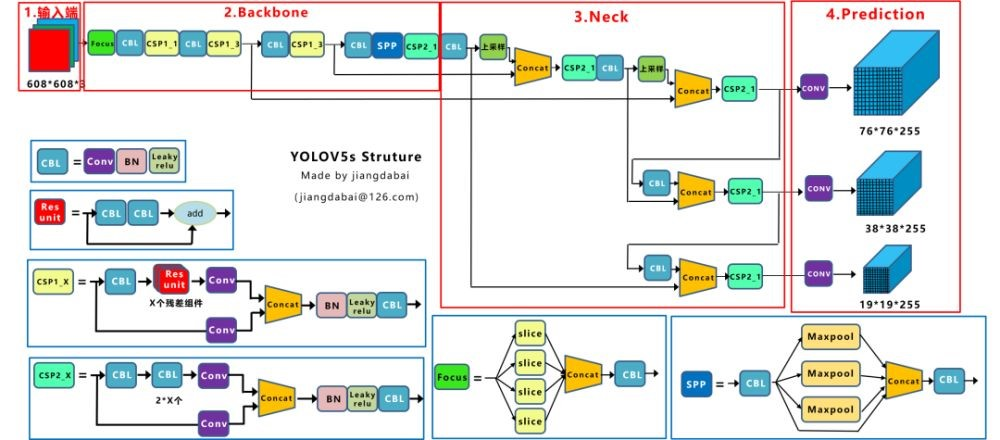

# Class-AI
## 在线课堂舆情检测系统
可识别认真听讲、玩手机、睡觉、发呆、非看屏幕状态五个动作。

具有GUI界面，可识别照片、视频以及实时拍摄。
## 数据集介绍
训练集共有685张图片以及一一对应的685个txt标签文件；又根据二八分的原则，切分出137张图片（137个txt文件）作为验证集；也就是说，训练集内包含548张图片（548个txt文件），验证集内包含137张图片（137个txt文件）。

数据集的训练是基于YOLO v5模型进行的。
## YOLO
YOLO v5是YOLO算法的版本之一，而“YOLO”是一个对象检测算法的名字，YOLO将对象检测重新定义为一个回归问题，它将单个卷积神经网络（CNN）应用于整个图像，将图像分成网格，并预测每个网格的类概率和边界框。

### 网络结构图

## Backone网络
### Focus结构
Foucs对图片进行切片操作，具体操作是在一张图片中每隔一个像素拿到一个值，类似于邻近下采样，这样拿到了四张图片，四张图片互补，虽然样式上差不多，但是没有信息丢失；这样一来，将W、H信息就集中到了通道空间，输入通道扩充了4倍，即拼接起来的图片相当于原先的RGB三通模式变成了12个通道，最后将得到的新图片再经过卷积操作，最终得到没有信息丢失的二倍下采样特征图。

## Head网络
在YOLO v5中采用CIOU_LOSS作为bounding box的损失函数，下面我们依次对IOU_Loss、GIOU_Loss、DIOU_Loss以及CIOU_Loss四种损失函数进行介绍。
### IOU_Loss损失函数
预测框与GT框之间的交集/预测框与GT框之间的并集。此种损失函数存在一定的问题，如下图所示，当预测框和GT框不相交时，即IOU=0，此时无法反映两个框之间的距离，也就使得我们的损失函数不可导，那么我们的损失函数就无法优化两个框相交的情况；当两个预测框大小相同时，这两个IOU也相同。

### GIOU_Loss损失函数
为了解决上述损失函数无法优化两个框相交的问题，GIOU_Loss损失函数增加了相交尺度的衡量方式，其引入最小外接矩阵及外接矩阵与并集的差集。

但此种方式并不能完全解决这种问题，仍然存在其他问题；比如：三种状态都是预测框与GT框内部且预测框大小一致的情况，此时两个框之间的差集是相同的，因此这三种状态的GIOU值也都是相同的，此时GIOU也就退化成了IOU，无法区分相对位置的关系。

### DIOU_Loss损失函数
针对IOU和GIOU损失所存在的问题，DIOU为了解决如何最小化预测框和GT框之间的归一化距离这个问题，DIOU_loss考虑了预测框与GT框的重叠面积和中心点距离，当GT框包裹预测框的时候，直接度量2个框的距离，因此DIOU_Loss的收敛速度更快一些。

如下图所示，当GT框包裹预测框时，预测框的中心点的位置都是一样的，因此按照DIOU_Loss的计算公式，三者的值都是相同的。

### CIOU_Loss损失函数
此种损失函数是我们YOLO v5使用的损失函数，其在DIOU_Loss的基础上增加了一个影响因子，将预测框和GT框的长宽比也考虑了进来，具体的计算方式如下：

可以看到，CIOU_Loss将GT框的重叠面积、中心点距离和长宽比全都考虑进来。

综上所述，IOU_Loss主要考虑了检测框和GT框之间的重叠面积；GIOU_Loss在IOU的基础上，解决边界框不重合时出现的问题；DIOU_Loss在IOU和GIOU的基础上，同时考虑了边界框中心点距离信息；CIOU_Loss在DIOU的基础上，又考虑了边界框宽高比的尺度信息。
## Leaky_ReLU激活函数
这是一种专门设计用于解决Dead ReLU问题的激活函数，其公式如下所示：

该函数具有如下特点：
* Leaky_ReLU函数通过把x的非常小的线性分量给予负输入0.01x来调整负值的零梯度问题；
* Leaky有助于扩大ReLU函数范围，通常α的值为0.01左右；
* Leaky_ReLU的函数范围时负无穷到正无穷。
其图像如下所示：

## 效果展示
### 图片检测

### 视频检测

### 实时检测

